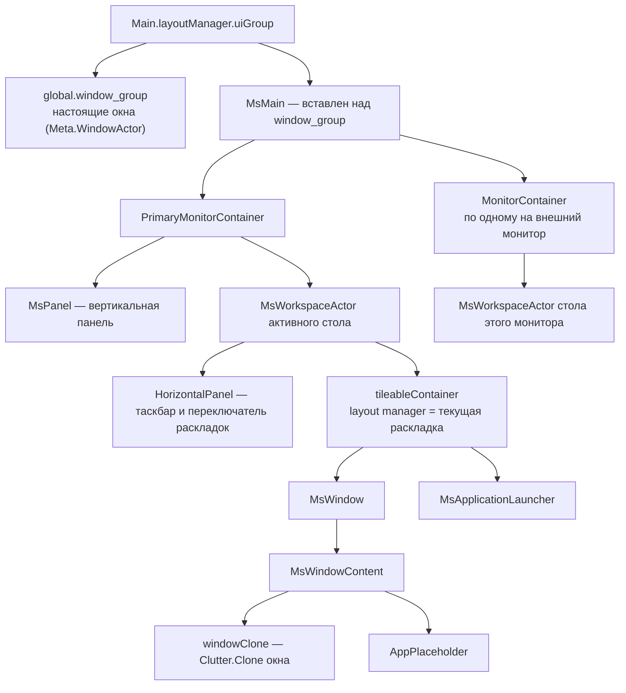
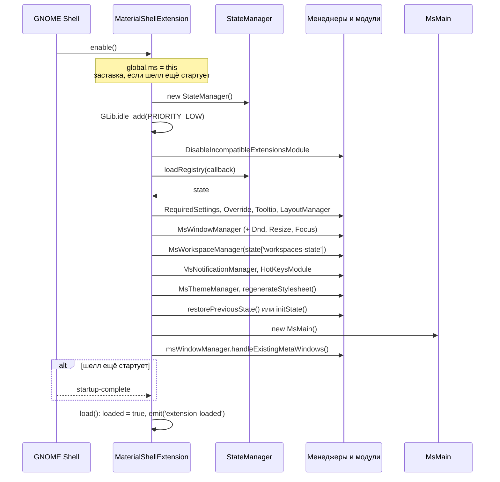
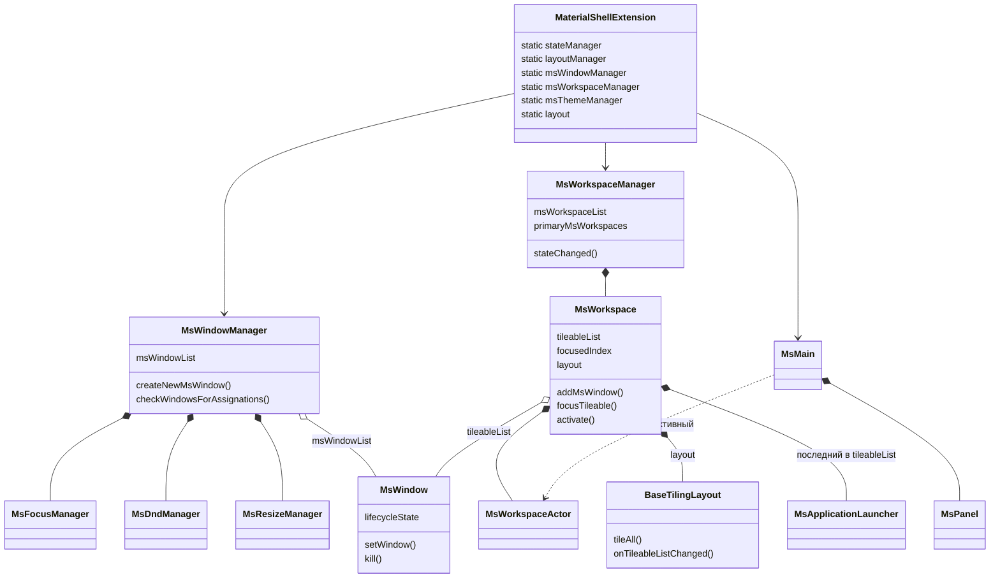
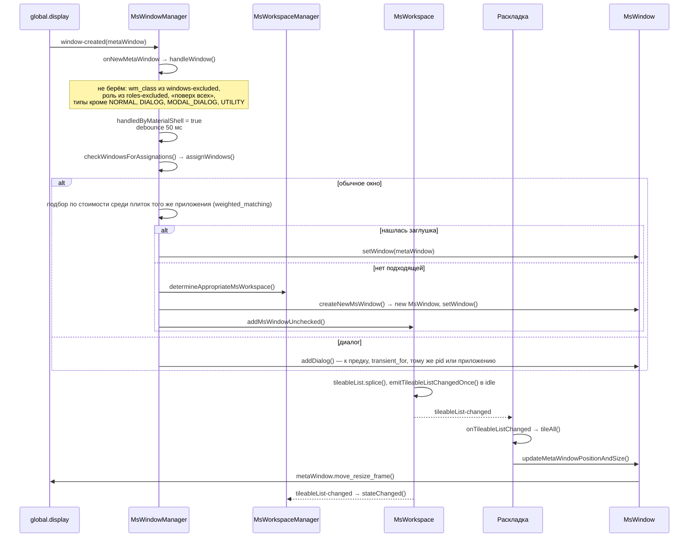
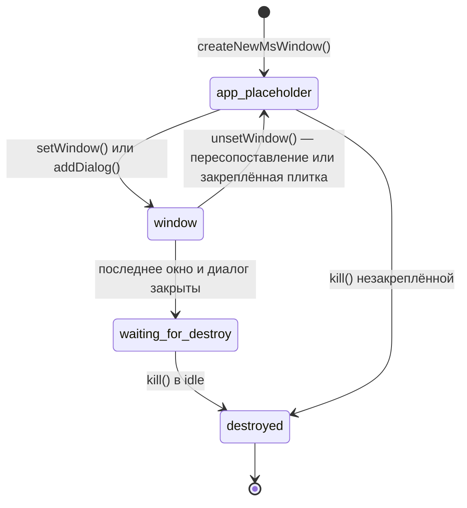
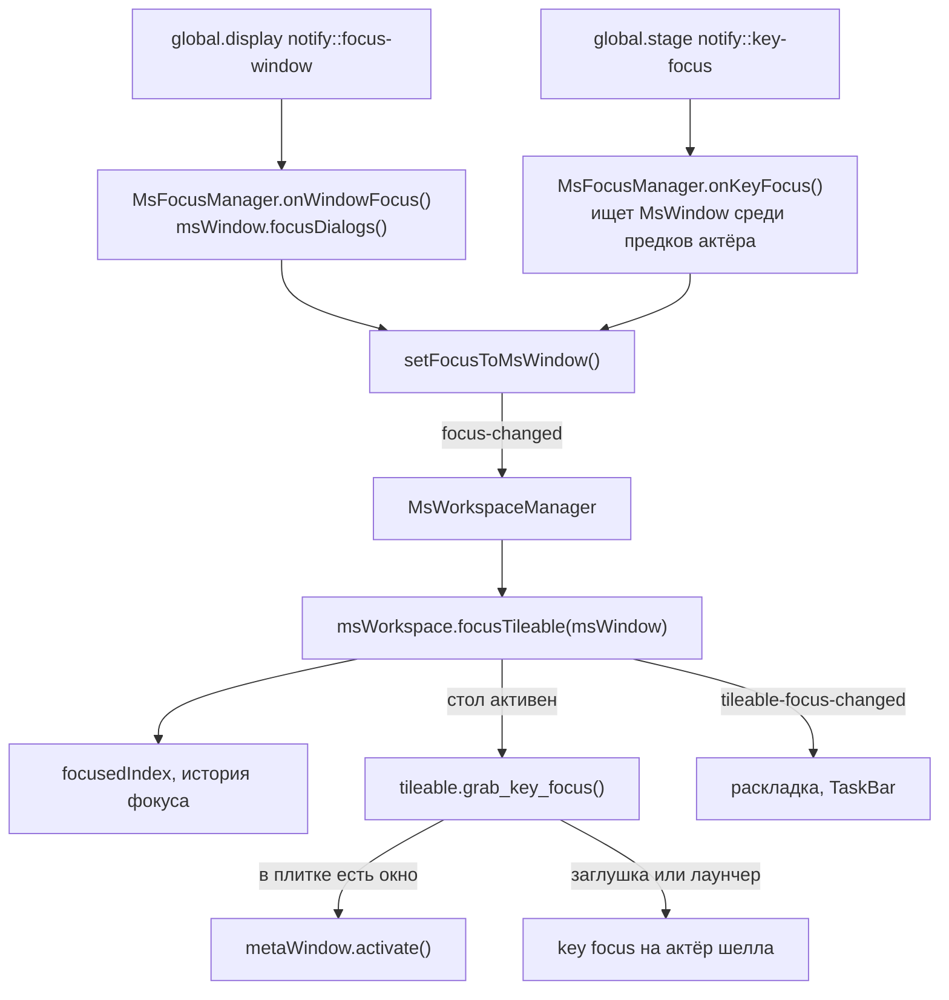
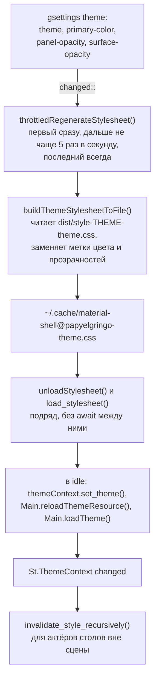

# Архитектура

Как части Material Shell взаимодействуют друг с другом и с GNOME Shell. Где
лежит каждый файл — в [FILES.md](FILES.md).

Схемы описывают ветку `gnome-50`. Имена методов и сигналов на них — настоящие,
их можно искать по коду.

## Место в GNOME Shell

GNOME Shell — это JavaScript поверх mutter. mutter управляет окнами (`Meta.*`),
Clutter рисует сцену из актёров, St добавляет к актёрам CSS. Расширение
работает в том же процессе и пользуется теми же объектами: `global.display`,
`global.workspace_manager`, `Main.layoutManager` и так далее.

Material Shell не рисует окна сам и не заменяет mutter. Он строит поверх окон
собственное дерево актёров и держит настоящие окна под ним в нужных местах.

Как это складывается в то, что видит пользователь:

- `MsMain` лежит над `window_group`, поэтому на экране виден `windowClone`
  внутри плитки, а не само окно.
- `MsWindow.updateMetaWindowPositionAndSize()` через `move_resize_frame`
  ставит настоящее окно ровно под плиткой. Пока в плитке есть окно, она
  нереактивна (`reactive = false`), и клики и клавиши достаются окну.
- Если плитка скрыта (`visible = false`), вынута из дерева или идёт
  перетаскивание, она сворачивает своё окно (`metaWindow.minimize()`) и
  разворачивает, когда снова видна: `updateMetaWindowVisibility()`.
- В раскладке `float` и в полноэкранном режиме связь обратная: плитка
  повторяет положение окна (`followMetaWindow`, `mimicMetaWindowPositionAndSize`).

Кроме этого, расширение подменяет части шелла. Каждая подмена снимается в
`destroy()` своего владельца:

| Что подменено | Где | Зачем |
|---------------|-----|-------|
| `WorkspaceTracker.prototype._checkWorkspaces` | `MsWorkspaceManager` | Пустой стол в конце и удаление пустых — по нашим плиткам, а не по окнам mutter. |
| `WindowManager.prototype._shouldAnimate` → `false` | `OverrideModule` | Анимации окон делаем сами. |
| `Meta.prefs_get_workspaces_only_on_primary` → `true` | `OverrideModule` | Столы переключаются только на основном мониторе. |
| `ExtensionManager.prototype._callExtensionEnable` | `DisableIncompatibleExtensionsModule` | Не дать включиться несовместимым расширениям. |
| gsettings `org.gnome.mutter`, `org.gnome.desktop.wm.preferences`, сочетания шелла | `RequiredSettingsModule` | Навязать нужные значения; вернуть прежние при выключении. |
| Индикаторы и меню даты `Main.panel` | `MsStatusArea` | Перенести в вертикальную панель. |
| `Main.overview` | `extension.ts` | `isDummy = true`: обзор шелла заменён своим, по клавише `Super`. |

## Жизненный цикл

Порядок создания не произвольный:

- `MsWorkspaceManager` в конструкторе подписывается на
  `Me.msWindowManager.msFocusManager`, поэтому `MsWindowManager` создаётся
  раньше.
- `MsWorkspace` при создании спрашивает у `Me.layoutManager` раскладки по
  умолчанию, а восстановленные окна создаёт через `Me.msWindowManager`.
- `MsMain` читает `Me.msThemeManager` и активный стол из
  `Me.msWorkspaceManager`.

Пока `loaded` не стало `true`, `StateManager.stateChanged()` ничего не
сохраняет, и восстановление не затирает сохранённое состояние.

`disable()` различает два случая:

- **Блокировка экрана** (`Main.sessionMode.currentMode === 'unlock-dialog'`).
  Шелл выключает расширения на время блокировки. Material Shell только прячет
  панель и ставит `locked = true`; следующий `enable()` видит флаг и просто
  показывает панель обратно. Ни окна, ни столы не пересоздаются.
- **Настоящее выключение.** `disableInProgress = true`, снимаются все таймеры
  `Async`, испускается `extension-disable`. Затем в обратном порядке
  разрушаются модули и менеджеры, `MsMain`, тема и `StateManager`.

## Карта объектов

Из любого места до менеджеров добираются через статические геттеры:
`import { default as Me } from 'src/extension'`, затем `Me.msWorkspaceManager`,
`Me.layout` и так далее. Сам экземпляр — `Me.instance`.

`MsWorkspace` бывает двух видов:

- **Основной монитор.** По одному `MsWorkspace` на каждый стол mutter, по
  индексу: `primaryMsWorkspaces[i]` ↔ `workspace_manager.get_workspace_by_index(i)`.
- **Внешний монитор.** Один `MsWorkspace` на монитор, без стола mutter
  (`workspace` возвращает `null`). Переключение столов его не касается —
  так работает навязанный `workspaces-only-on-primary`.

## Путь окна

От появления окна в mutter до места в раскладке:

Подбор по стоимости нужен ради восстановления после перезахода. Восстановленный
стол сначала содержит плитки-заглушки со сведениями о прежних окнах:
`wmClass`, `pid`, `title`, `stableSeq`. Каждое новое окно получает ту заглушку,
с которой расходится меньше всего. Первые 3 секунды после сопоставления оно
ещё может перейти в другую плитку. Так бывает, когда редактор открывает
несколько окон с одинаковым заголовком и лишь потом подгружает документы.

Окно закрылось — mutter испускает `unmanaged`:

- `MsWindowManager.onMetaWindowUnManaged()` → `msWindow.metaWindowUnManaged()`.
- Если у плитки не осталось ни окна, ни диалогов, закреплённая (`persistent`)
  плитка возвращается в заглушку, остальные переходят в `waiting-for-destroy`.
- В idle такая плитка убивается, если за это время не появилось нового окна.
  Это нужно для приложений, которые при закрытии диалога открывают другое окно.

### Состояния `MsWindow`

`app-placeholder` с `waitingForAppSince` означает, что для этой плитки
запущено приложение и она ждёт его окно. Через 5 секунд без окна
незакреплённая плитка закрывается. Пока открыт диалог polkit, отсчёт стоит.

## Сигналы

Менеджеры и модели наследуют `WithSignals` или `MsManager` и общаются
сигналами. Подписка через `MsManager.observe()` снимается автоматически
в `destroy()`. Подписку через голый `connect()` нужно снять самому.

Сигналы Material Shell:

| Источник | Сигнал | Кто слушает | Когда |
|----------|--------|-------------|-------|
| `MsWorkspace` | `tileableList-changed` | раскладка, `TaskBar`, `WorkspaceList`, `MsWorkspaceManager`, сам `MsWorkspace` (категория) | Список плиток изменился. При добавлении и удалении — в idle, не чаще раза за такт. |
| `MsWorkspace` | `tileable-focus-changed` | раскладка, `TaskBar` | Фокус перешёл на другую плитку. |
| `MsWorkspace` | `tiling-layout-changed` | `MsWorkspaceManager` → `StateManager`, `LayoutSwitcher` | Сменилась раскладка. |
| `MsWorkspace` | `readyToBeClosed` | `MsWorkspaceManager` | После `close()`: все окна стола закрыты. |
| `MsWindow` | `title-changed` | `TaskBar` | Заголовок окна или состав окон плитки. |
| `MsWindow` | `request-new-meta-window` | `MsWindowManager` → `openAppForMsWindow()` | Клик по заглушке. |
| `MsWindowManager` | `ms-window-created` | `MsDndManager` | Создана плитка. |
| `MsFocusManager` | `focus-changed` | `MsWorkspaceManager` → `msWorkspace.focusTileable()` | Фокус перешёл к окну другой плитки. |
| `MsWorkspaceManager` | `switch-workspace` | `MsMain` | Сменился активный стол. |
| `MsWorkspaceManager` | `dynamic-super-workspaces-changed` | `MsMain`, `WorkspaceList` | Столы добавлены, удалены, переставлены или переехали между мониторами. |
| `LayoutManager` | `gap-changed` | раскладки с изменяемыми размерами | Настройки отступов. |
| `MsThemeManager` | `panel-size-changed`, `*-panel-position-changed`, `panel-icon-*-changed`, `blur-background-changed`, `focus-effect-changed`, `clock-*-changed` | панели, `MsMain`, раскладки | Соответствующая настройка темы. |
| `MaterialShellExtension` | `extension-disable` | `MsMain`, вертикальная панель | Начало настоящего выключения. |

Сигналы mutter и шелла, от которых всё начинается:

| Объект | Сигнал | Кто слушает |
|--------|--------|-------------|
| `global.display` | `window-created` | `MsWindowManager` |
| `global.display` | `window-entered-monitor` | `MsWorkspaceManager` — перенос плитки на стол другого монитора |
| `global.display` | `notify::focus-window` | `MsFocusManager` |
| `global.stage` | `notify::key-focus` | `MsFocusManager` |
| `global.workspace_manager` | `workspace-added`, `workspace-removed` | `MsWorkspaceManager` |
| `global.workspace_manager` | `active-workspace-changed` | `MsFocusManager` |
| `global.window_manager` | `switch-workspace` | `MsWorkspaceManager`, `HotKeysModule` |
| `Meta.Workspace` | `window-added` | `MsWorkspaceManager` — окно перенесли на другой стол |
| `Main.layoutManager` | `monitors-changed` | `MsWorkspaceManager`, `MsMain` |
| `global.display` | `overlay-key`, `in-fullscreen-changed` | `MsMain` |

Настройки доходят до экрана так: gsettings испускает `changed::ключ`,
менеджер ловит его через `observe()`, обновляет своё поле и либо сам
перестраивает раскладку (`LayoutManager.tileWindows()`), либо испускает свой
сигнал для актёров (`MsThemeManager`).

## Фокус

Фокус живёт в двух местах сразу:

- **фокус окна mutter** (`global.display.focus_window`) — какому приложению
  идут клавиши;
- **key focus Clutter** (`global.stage.key_focus`) — какой актёр шелла их
  получает. Заглушка, лаунчер, поле поиска в панели — это актёры шелла.

`MsFocusManager` сводит оба к одному вопросу: какая плитка сейчас в фокусе.

Переключение стола (`MsWorkspace.activate()`) идёт так:

- если в фокусе окно — `workspace.activate_with_focus(metaWindow)`;
- иначе `workspace.activate()`, а фокус на время забирается stage grab'ом
  и отдаётся плитке через `refreshFocus()`.

После смены стола `MsFocusManager` 100 мс держит `focusProtected`. Если в это
время key focus пропадёт, он вернётся на прежний актёр, но только если тот
остался на видимом столе.

**Главное правило.** Пока key focus держит актёр шелла или поднят stage grab
(`Main.pushModal`, `global.stage.grab`), mutter не передаёт клавиши
Wayland-клиентам. Отпускание сочетания до окна не доходит, и оно считает
клавишу нажатой. Отсюда залипания из [#2](https://github.com/3axapp/material-shell/issues/2)
и [#10](https://github.com/3axapp/material-shell/issues/10). Любая правка,
которая ставит key focus на актёр или берёт grab, должна отвечать на вопрос,
когда фокус уйдёт обратно к окну. Подробнее — в
[PLAYBOOKS.md](PLAYBOOKS.md#залипает-клавиша).

## Тема

- **Цвет и прозрачности.** CSS собирается один раз при сборке, а настройки
  пользователя подставляются во время работы простой заменой текста.
  Поэтому три значения-метки в `stylesheet.scss` менять нельзя, а
  прозрачность хранится в процентах и делится на 100.
- **Порядок unload и load.** Между ними нет `await`. Два перекрывающихся
  вызова иначе загружали стиль дважды и ломали `St.Theme` до конца сессии:
  [#9](https://github.com/3axapp/material-shell/issues/9).
- **Столы вне сцены.** St обходит только прикреплённые к сцене актёры. Столы,
  которых сейчас не видно, сохраняли бы кэш стиля от старой темы, поэтому их
  сбрасывают вручную.

Остальные настройки темы — размер и положение панелей, иконки, размытие,
часы, эффект фокуса — CSS не трогают. Они приходят к актёрам сигналами
`MsThemeManager`.

## Сохранённое состояние

```mermaid
flowchart LR
    change["изменение плиток, раскладки,<br/>фокуса, столов"] --> wsmState["MsWorkspaceManager.stateChanged()<br/>в idle: _checkWorkspaces()"]
    wsmState --> smChanged["StateManager.stateChanged()<br/>в idle"]
    smChanged -->|"tweaks/enable-persistence"| save["setState('workspaces-state',<br/>msWorkspaceManager.state)"]
    save --> persist["global.set_persistent_state('material-shell-state')"]
    persist -.->|"следующий enable()"| load["loadRegistry()"]
    load --> restore["restorePreviousState()<br/>плитки-заглушки с matchingInfo"]
```

- **Ключи состояния.** `workspaces-state` — столы, их раскладки, фокус и
  плитки с `matchingInfo` и размерами. `panels-visible` хранит режим «без
  интерфейса» (`Super+Escape`). Идентификатор и время последнего запроса
  новостей хранит `MsNotificationManager`.
- **Когда не сохраняется.** Пока идёт восстановление, смена мониторов или
  выключение, сохранение пропускается: `restoringState`, `updatingMonitors`,
  `disableInProgress`.
- **Старый формат.** `loadRegistry()` умеет читать старый файл
  `~/.cache/material-shell@papyelgringo-state.json`, а `updateState()`
  переводит старую схему в новую.
- **Сброс.** Как сбросить состояние, описано в основном
  [README](../../README.md#reset-material-shell).
