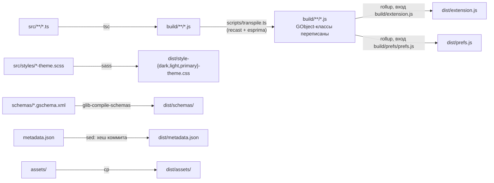

# Документация для разработчиков

Material Shell — расширение GNOME Shell. Код пишется на TypeScript, собирается
в ES-модули и работает внутри процесса `gnome-shell` вместе с его собственным
JavaScript. Эта ветка портирована на GNOME 50 (`shell-version` в
`metadata.json`).

| Файл | Когда читать |
|------|--------------|
| Этот | Перед первой сборкой: окружение, сборка, цикл проверки, логи, ветки. |
| [FILES.md](FILES.md) | Ищете, где лежит код, или куда положить новый. |
| [ARCHITECTURE.md](ARCHITECTURE.md) | Нужно понять, кто кого вызывает: жизненный цикл, путь окна, фокус, тема. |
| [PLAYBOOKS.md](PLAYBOOKS.md) | Что-то сломалось или надо сделать типовую вещь — с чего начать. |

Проверки окна настроек описаны отдельно, в [tests/README.md](../../tests/README.md).

## Окружение

- GNOME Shell 50 в сессии Wayland — под ней ведётся разработка.
- `node` и `npm`: TypeScript, rollup и sass ставятся в `node_modules`.
- `gjs`, `glib-compile-schemas`, `glib-compile-resources` — для сборки схем и
  для `make test`.

## Сборка

```sh
make install     # npm install, make compile, ссылка ~/.local/share/gnome-shell/extensions → dist/, включение
make compile     # только сборка в dist/
npm run dev      # сборка при каждом сохранении (tsc-watch)
make test        # проверки окна настроек
make build_prod  # dist.zip для extensions.gnome.org
```

`make install` достаточно выполнить один раз: дальше ссылка указывает на
`dist/`, и новая сборка сразу попадает на место установки.



Что делает каждый шаг:

- **tsc** компилирует в `build/` с `target: es2018`. Синтаксис новее ES2018
  (`?.`, `??`, поля классов) он понижает, а object spread и rest
  (`{...a}`, `const {x, ...rest} = a`) оставляет как есть: это уже ES2018.
- **transpile.ts** находит классы с декоратором `@registerGObjectClass` и
  переписывает у них `constructor` в `_init`, а `super(...)` — в
  `super._init(...)`. Парсит он через recast, а тот по умолчанию — через
  esprima 4, который object spread не знает. Поэтому **object spread и rest
  в `src/` ломают сборку**; вместо них пишите `Object.assign`. Сообщение
  об ошибке и файл `temp.js`, который при этом появляется, разобраны в
  [PLAYBOOKS.md](PLAYBOOKS.md#сборка-падает-на-transpile).
- **rollup** склеивает всё в два файла и разрешает импорты вида
  `src/...`. Импорты `gi://` и `resource:///` остаются внешними — их
  разрешает сам шелл.
- **sass** даёт три темы из одного `stylesheet.scss`. Готовый CSS читается
  во время работы, а не при загрузке расширения. Подробнее — в
  [ARCHITECTURE.md](ARCHITECTURE.md#тема).

Цель `dist` в `Makefile` делает `rm -rf dist`, и от неё зависят `schemas` и
`sass`. Поэтому `make sass` отдельно от `make compile` оставит `dist/` без
`extension.js`. Собирайте целиком.

## Как увидеть изменения

| Что поменяли | Что сделать |
|--------------|-------------|
| Код расширения (`src/` кроме `prefs/`) | `make compile`, затем запустить [вложенный шелл](#вложенный-шелл) или **выйти из сессии и войти снова**. `gnome-extensions disable` и `enable` не помогают: начиная с GNOME 45 шелл кэширует ES-модуль расширения и второй раз его не читает. |
| Стили (`src/styles/`) | `make compile`, затем изменить основной цвет (`primary-color`) и вернуть обратно. CSS пересобирают только `theme`, `primary-color`, `panel-opacity` и `surface-opacity`: тогда `MsThemeManager` перечитывает `dist/style-*-theme.css`. Остальные настройки темы стиль не перезагружают. |
| Окно настроек (`src/prefs/`) | `make compile`, затем `gnome-extensions prefs material-shell@papyelgringo`. Настройки открываются в отдельном процессе, перезаход не нужен. |
| Схемы (`schemas/`) | `make compile`. В работающем шелле новые ключи появятся только после перезахода, `Gio.Settings` создаются при включении расширения. Вложенный шелл увидит их сразу. |

Каждый перезаход обходится дорого. На Wayland падение шелла тоже заканчивает
сессию, вместе с открытыми терминалами и всем, что в них было. Поэтому
проверяйте во вложенном шелле всё, что он позволяет, а в настоящую сессию
переходите за финальной проверкой. Расследование, которое требует нескольких
перезаходов, ведите в файле, а не в голове.

### Вложенный шелл

`gnome-shell --devkit` запускает отдельный GNOME Shell в окне Mutter
Development Kit. Окно даёт пакет `mutter-devkit`; в Arch это отдельный пакет.
Каждый запуск — новый процесс, поэтому он загружает свежий `dist/` без
перезахода. Проверено на GNOME 50.4.

Запускайте его только с отдельным `HOME`. Иначе вложенный Material Shell
будет писать в ваш dconf, в `~/.local/share/gnome-shell/material-shell-state`
и в `~/.cache`, и после следующего перезахода восстановится его состояние, а
не ваше. Команду можно запускать из любого каталога репозитория:

```sh
MS=$(git rev-parse --show-toplevel)   # корень репозитория, из любого его каталога
SB=~/.cache/ms-devkit                 # отдельный HOME: свои dconf, состояние и кэш
test -f "$MS/dist/extension.js" || make -C "$MS" compile
mkdir -p "$SB/.local/share/gnome-shell/extensions"
ln -sfn "$MS/dist" "$SB/.local/share/gnome-shell/extensions/material-shell@papyelgringo"
env -u XDG_CONFIG_HOME -u XDG_DATA_HOME -u XDG_CACHE_HOME HOME="$SB" dbus-run-session -- sh -c '
    dconf write /org/gnome/shell/enabled-extensions "@as []"
    dconf write /org/gnome/shell/disable-user-extensions false
    # Расширение включаем только после того, как Mdk создаст свой монитор:
    # тогда этот монитор единственный и основной, и панели видно в окне.
    ( for i in $(seq 400); do
          gdbus call --session --dest org.gnome.Mutter.DisplayConfig \
              --object-path /org/gnome/Mutter/DisplayConfig \
              --method org.gnome.Mutter.DisplayConfig.GetCurrentState 2>/dev/null |
              grep -q "Meta-" && break
      done
      dconf write /org/gnome/shell/enabled-extensions "[\"material-shell@papyelgringo\"]" ) &
    exec gnome-shell --devkit --wayland-display ms-devkit
' 2>&1 | tee "$SB/log"
```

Порядок здесь важен. Шелл стартует раньше, чем Mdk создаёт свой монитор, а
`MsMain` требует основной монитор и без него падает на `assertNotNull`
(`Expected value, but found null`). Если же дать монитор флагом
`--virtual-monitor`, расширение поднимется, но основным окажется именно этот
монитор, а окно Mdk показывает свой — и левой панели в нём не будет.

Проверить, что расширение поднялось:
`grep -c "ENABLE EXTENSION" "$SB/log"` — должна быть одна строка, и рядом
`EXTENSION LOADED`. В окне должны быть видны левая панель со списком столов и
верхняя панель задач.

Если что-то пошло не так:

| Что видно | Что случилось |
|-----------|---------------|
| Окно открылось, интерфейс обычный, в логе нет `ENABLE EXTENSION` | Каталог расширения в песочнице пуст или симлинк битый. Проверьте: `readlink -f "$SB/.local/share/gnome-shell/extensions/material-shell@papyelgringo"` — внутри должен лежать `extension.js`. |
| Лаунчер Material Shell есть, а панелей нет | Расширение включилось раньше, чем появился монитор Mdk, или монитор задан флагом `--virtual-monitor`. Основным стал монитор, которого в окне не видно: панели на нём. Используйте команду выше, с отложенным включением. |
| `JS ERROR: Error: Expected value, but found null` сразу после `ENABLE EXTENSION` | Расширение включилось, когда мониторов ещё не было. То же лечение. |
| `org.gnome.Shell already exists on bus`, процесс сразу вышел | Запущено без `dbus-run-session`. Голый `gnome-shell --devkit` внутри работающей сессии не стартует: имя на шине уже занято вашим шеллом. |

- **Логи** идут в терминал и в `$SB/log`, а не в журнал. Загрузка видна
  как `ENABLE EXTENSION` … `EXTENSION LOADED`, `Debug.log` — строками
  `Material Shell-Message:`.
- **Второй монитор.** Каждый флаг `--virtual-monitor` добавляет монитор, но
  окно Mdk показывает только свой собственный, поэтому лишние мониторы видны
  лишь в логах и через зонд. Кнопку «+» в окне Mdk я не проверял.
- **Окно Mdk** в вашей сессии — обычное приложение, и ваш Material Shell
  отводит под него плитку. Когда окно закрывается, плитка исчезает.
- **Остановить** — закрыть окно Mdk или нажать `Ctrl+C` в терминале.
- **Что не проверено.** Клавиатура приходит во вложенный шелл через окно Mdk,
  поэтому залипания клавиш и фокус Wayland-клиентов во вложенном шелле не
  проверялись. Для них финальная проверка — в настоящей сессии. Looking Glass
  внутри тоже не проверялся.

## Логи и инспекция

```sh
journalctl -b -f -o cat /usr/bin/gnome-shell        # всё, что пишет шелл, включая «JS ERROR» со стеком
journalctl -b -f -o cat 'GLIB_DOMAIN=Material Shell' # только Debug.log из src/utils/debug.ts
```

`Debug.log` пишет в журнал с доменом `Material Shell`. Для временного зонда
удобно завести собственный домен (`GLib.log_structured('MS42', …)`) и
фильтровать по нему. Зонд удаляется до коммита.

Looking Glass открывается через `Alt+F2` → `lg`. Экземпляр расширения лежит в
`global.ms`, поэтому оттуда видны все менеджеры:
`global.ms.msWorkspaceManager.msWorkspaceList`,
`global.ms.msWindowManager.msWindowList` и так далее.

## Ветки и коммиты

- `main` — последний коммит исходного проекта, от которого начат порт.
- `gnome-50` — рабочая ветка порта. Всё новое попадает сюда.
- Работа по задаче идёт в ветке `issue-N` от `gnome-50`. Сообщения
  коммитов — по-английски, с номером в начале: `issue-9 Throttle stylesheet
  regeneration`. В `gnome-50` ветка вливается merge-коммитом
  `Merge branch 'issue-N' into gnome-50`.
- Стиль кода задают `.eslintrc.js` и `.prettierrc`: четыре пробела в коде,
  два в документации, camelCase без сокращений.
